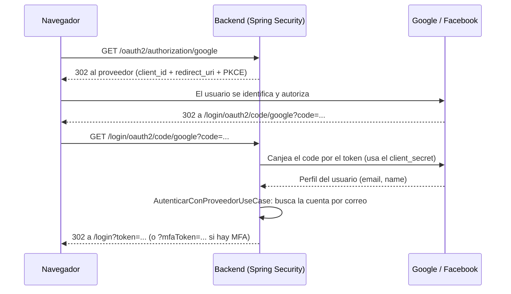

# POS Farmacia

Sistema de punto de venta para farmacias construido con **Clean Architecture** en el backend y
mensajería basada en eventos con **Apache Kafka** y **RabbitMQ**.

Cubre el flujo completo de una farmacia: apertura y cierre de caja, ventas con validación de
stock en tiempo real, despacho de lotes por FEFO, control de medicamentos que requieren receta,
convenios de seguro con cálculo de copago, líneas de crédito, devoluciones y notas de crédito,
reportes de ventas e incentivos, y auditoría de operaciones sensibles.

## Características principales

- **Caja y ventas** — apertura/cierre de caja, punto de venta, múltiples formas de pago,
  comprobantes electrónicos.
- **Inventario por lotes (FEFO)** — control de vencimientos, despacho del lote más próximo a
  vencer, bloqueo y retiro de lotes.
- **Recetas médicas** — validación de medicamentos controlados antes de la venta.
- **Seguros y crédito** — convenios de cobertura, cálculo automático de copago, líneas de
  crédito con validación de saldo.
- **Devoluciones y notas de crédito** — reversión de stock y reconciliación de venta.
- **Auditoría** — registro de operaciones sensibles (anulaciones, cambios de precio, ajustes de
  stock, cambios de promoción) publicado como evento y persistido de forma asíncrona.
- **Reportes e incentivos** — ventas diarias y cálculo de incentivos por reglas configurables.

## Arquitectura

El backend sigue Clean Architecture: el dominio y los casos de uso no dependen de ningún
framework, y toda la infraestructura (base de datos, HTTP, mensajería) vive detrás de puertos
que el núcleo del sistema define.

```
backend/
├── pos-domain/                # Entidades y reglas de negocio
├── pos-usecases/              # Casos de uso, puertos de entrada/salida
├── pos-adapters-web/          # Controladores REST
├── pos-adapters-persistence/  # Repositorios JPA y migraciones
├── pos-adapters-external/     # Integraciones externas
├── pos-adapters-messaging/    # Publicadores y consumidores de Kafka y RabbitMQ
└── pos-infrastructure/        # Arranque de Spring Boot y ensamblado de dependencias
```

Detalle completo de las capas y la regla de dependencia en [`docs/ARQUITECTURA.md`](docs/ARQUITECTURA.md).

### Mensajería

- **Apache Kafka** publica hechos de negocio ya confirmados (ventas, operaciones auditables)
  como eventos que uno o más consumidores pueden procesar de forma independiente.
- **RabbitMQ** encola tareas puntuales —como la emisión del comprobante electrónico— para que
  se ejecuten de forma asíncrona sin bloquear el flujo de venta.

Justificación de por qué se usan ambos brokers y no solo uno en
[`docs/KAFKA_Y_RABBITMQ.md`](docs/KAFKA_Y_RABBITMQ.md).

## Autenticación

El POS tiene tres puertas de entrada —usuario y contraseña, Google y Facebook— y las tres
terminan en el mismo sitio: un JWT firmado por `JwtTokenIssuer` con los roles y permisos de
siempre. Si la cuenta tiene activada la verificación en dos pasos, antes del JWT de sesión se
pide un código TOTP de Google Authenticator.

### Cómo funciona el login social

Lo que hay que entender del flujo es que **el POS nunca ve la contraseña del usuario**. Google o
Facebook verifican la identidad y le devuelven al backend un único dato útil: el correo. Con ese
correo el POS resuelve a qué cuenta corresponde.



Paso a paso, con los nombres reales:

1. El botón de `LoginPage.jsx` es un enlace a `/oauth2/authorization/{google|facebook}`. Esa ruta
   no está escrita en el proyecto: la expone Spring Security a partir del registro que hay en
   `application.yml`.
2. Spring redirige al proveedor con el `client_id`, el `scope` (`email` en ambos casos) y la
   `redirect_uri` a la que quiere volver.
3. El usuario se identifica **en la página del proveedor**. Ni la contraseña ni el segundo factor
   del proveedor pasan por el POS.
4. El proveedor devuelve al navegador a `/login/oauth2/code/{proveedor}` con un código de un solo
   uso. Spring lo canjea por el token de acceso desde el servidor —ahí es donde se usa el
   `client_secret`— y obtiene el perfil.
5. `OAuth2LoginSuccessHandler` toma el correo y se lo pasa a `AutenticarConProveedorUseCase`, que
   busca la cuenta del POS por ese correo. **Si no existe, la crea con el rol mínimo de Cajero**,
   para que un administrador le ajuste el rol después.
6. El handler firma el JWT y redirige al frontend a `/login?token=...`. Si la cuenta tiene MFA,
   lo que viaja es `?mfaToken=...`: un token de 5 minutos con `scope = MFA_PENDIENTE` que solo
   sirve para `POST /api/auth/mfa/verificar`.

El login con contraseña y el social convergen en el mismo paso 6, así que hay un solo lugar donde
se emiten sesiones y uno solo que auditar.

### Credenciales

Las cuatro credenciales (`GOOGLE_CLIENT_ID`, `GOOGLE_CLIENT_SECRET`, `FACEBOOK_CLIENT_ID`,
`FACEBOOK_CLIENT_SECRET`) van en el archivo `.env` de la raíz, que git ignora. Sin ellas los
botones existen pero el proveedor responde `invalid_client`.

La URI de redirección que hay que registrar en cada consola es
`http://localhost:8089/login/oauth2/code/{google|facebook}` — **puerto 8089**, el que publica
`docker-compose.yml`, no el 8080 interno del contenedor.

El registro completo en ambas consolas, con los pasos que los asistentes no mencionan (usuarios
de prueba en Google, permiso `email` en Facebook) está en
[`docs/autenticacion/REGISTRAR_APPS_GOOGLE_Y_FACEBOOK.md`](docs/autenticacion/REGISTRAR_APPS_GOOGLE_Y_FACEBOOK.md).

## Stack tecnológico

| Capa | Tecnología |
|---|---|
| Backend | Java 17, Spring Boot, Spring Data JPA, Spring Security (JWT) |
| Frontend | React, Vite |
| Base de datos | PostgreSQL, Flyway |
| Mensajería | Apache Kafka, RabbitMQ |
| Documentación de API | springdoc-openapi / Swagger UI |
| Contenedores | Docker, Docker Compose |

## Puesta en marcha

Requisitos: Docker y Docker Compose.

```bash
cp .env.example .env
docker compose up -d --build
```

| Servicio | URL |
|---|---|
| Aplicación web | http://localhost:5174 |
| API REST | http://localhost:8089 |
| Documentación de la API | http://localhost:8089/api/v1/swagger-ui.html |
| Kafka UI | http://localhost:8090 |
| RabbitMQ Management | http://localhost:15673 |

Guía paso a paso, incluida una verificación funcional completa, en
[`docs/COMO_EJECUTAR.md`](docs/COMO_EJECUTAR.md).

## Pruebas

```bash
cd backend
./mvnw test
```

## Documentación

| Documento | Contenido |
|---|---|
| [`docs/ARQUITECTURA.md`](docs/ARQUITECTURA.md) | Capas del backend y regla de dependencia |
| [`docs/KAFKA_Y_RABBITMQ.md`](docs/KAFKA_Y_RABBITMQ.md) | Diseño de la mensajería y sus casos de uso |
| [`docs/COMO_EJECUTAR.md`](docs/COMO_EJECUTAR.md) | Puesta en marcha y verificación funcional |
| [`docs/autenticacion/`](docs/autenticacion/README.md) | Login social y segundo factor: manual de uso, cambios en el código y decisiones de diseño |
| [`docs/autenticacion/REGISTRAR_APPS_GOOGLE_Y_FACEBOOK.md`](docs/autenticacion/REGISTRAR_APPS_GOOGLE_Y_FACEBOOK.md) | Paso a paso para crear las credenciales en Google Cloud y Meta for Developers |

## Estructura del repositorio

```
.
├── backend/           # API REST (Java + Spring Boot, multimódulo Maven)
├── frontend/           # Aplicación web (React + Vite)
├── docs/               # Documentación técnica
├── base/               # Reglas de negocio y especificación funcional
└── docker-compose.yml  # Orquestación de todos los servicios
```
